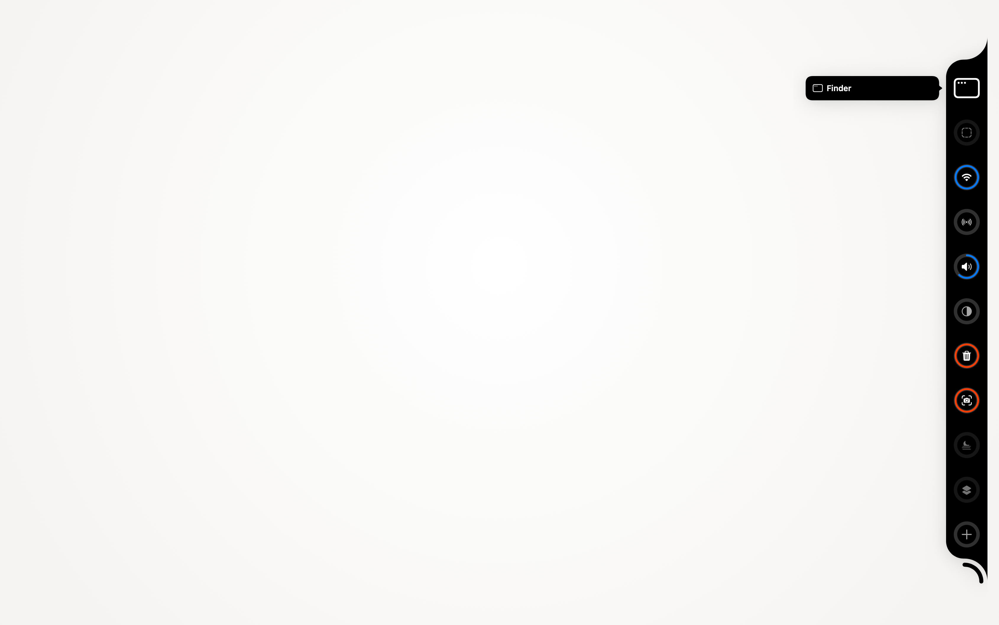
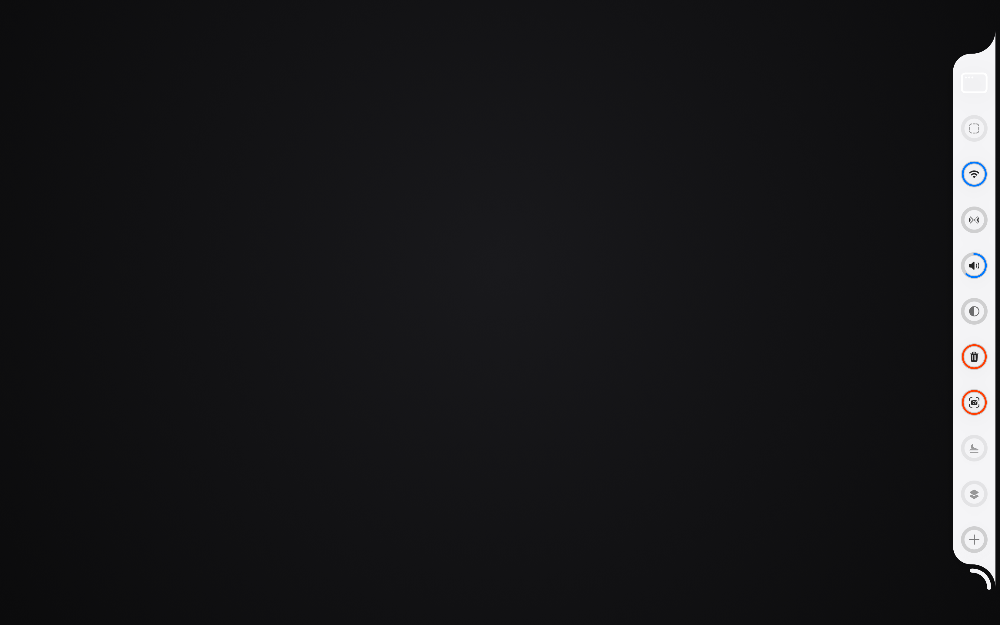
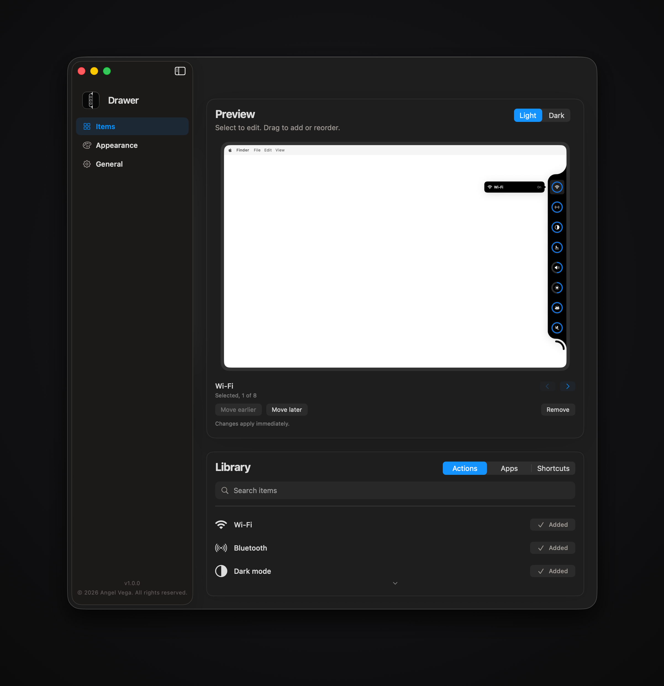
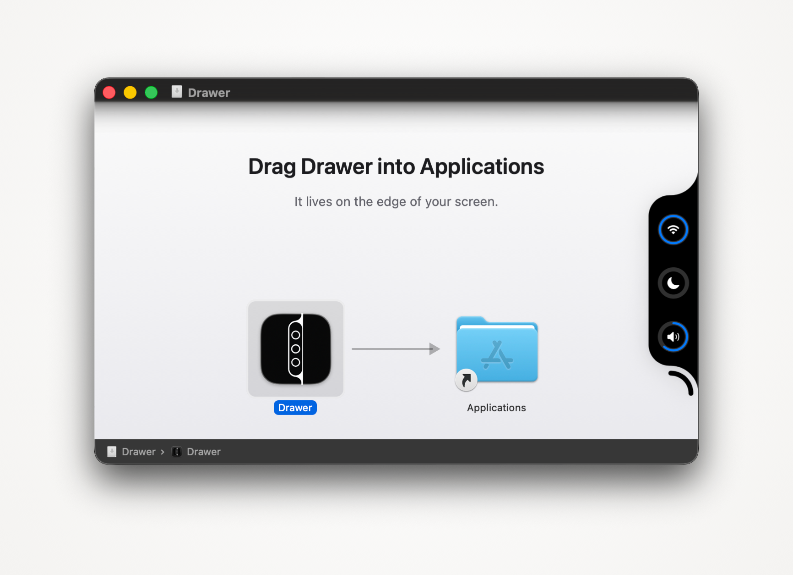

# Drawer

A drawer at the edge of your screen. Point at it and it unfolds into a column
of round cells: an app to launch, a system toggle, a level to drag, an Apple
Shortcut to run. Point away and it folds back into a thin black pill against
the bezel.



<p align="center">
  
</p>

<p align="center">
  
</p>

## Install

Download the disk image from the
[latest release](https://github.com/advegaf/drawer/releases/latest), open it,
and drag Drawer into Applications. It is signed with a Developer ID and
notarized by Apple, so it opens on a normal double click.



Requires macOS 26.

## What it does

**Point at the edge.** The pill sits on the right or the left, whichever side
your Dock leaves alone. Hover unfolds it; the pointer leaving folds it away.

**Or press a chord.** Shift Command Space by default, changeable on the
General page. While the drawer is open by chord it holds the keyboard: the
arrows move between cells, Return activates one, Escape closes it.

**Pin what you use.** Settings has a library of every action, app and
shortcut. Drag one onto the preview of your drawer, or use the Add button on
its row. Drag inside the preview to reorder. Hovering a row you have already
added turns the Added chip into a red Remove.


**Actions, not just launchers.** Wi-Fi, Bluetooth, dark mode, Night Shift,
Stage Manager, volume and brightness as levels you drag, keep awake, lock
screen, sleep, sleep displays, empty trash, three kinds of screenshot, Mission
Control, show desktop, screen saver, quit the app in front, hide the others,
force quit, eject every disk, restart, shut down, log out, desktop icons,
hidden files, Dock and menu bar auto-hide, battery percentage, relaunch the
Finder or the Dock, play and pause, next and previous track, mute the
microphone, lock the keyboard so it can be wiped, paste without formatting,
and screen recording.

A secondary click on Wi-Fi, Bluetooth or Volume opens a picker instead of a
toggle: the networks this Mac knows, the paired devices with the connected
ones first, or the outputs sound can go to.

Focus opens Control Center's own Focus modes, which is the one thing macOS
gives no supported way to set directly. To go straight to a single mode, make
a shortcut with the Set Focus action and pin that: any Apple Shortcut can be a
cell.

The four that cannot be taken back (eject, restart, shut down, log out) do
nothing on the first click. The cell arms, and a second click within a few
seconds does it.

## Permissions

macOS asks the first time an action needs one.

| What you use | What it asks for | Why |
| --- | --- | --- |
| Dark mode, Empty Trash, Restart, Shut Down, Log Out, Force Quit | Automation | They are System Events and Finder commands |
| Clean Keyboard, Paste as Text, the transport keys | Accessibility | Posting and swallowing keystrokes needs it |
| Bluetooth | Bluetooth | Reading and setting the radio's power |

Nothing leaves the machine. There is no account, no analytics and no network
call in the app.

## Appearance

Follow macOS, OLED or Light, an accent colour, three cell sizes and optional
labels. Follow macOS switches live with the system appearance. The resting
pill stays black in every finish.


## Build it yourself

```sh
brew install xcodegen
make run     # generate the project, build, launch
make test    # the suite
```

`make shot NAME=... ENV="..."` captures a window through the window server, and
`Tools/Screenshots/make-docs-images.sh` regenerates every image on this page.

Releases are built with `Tools/Release/release.sh`: archive, Developer ID
export, notarize, staple, disk image, notarize the image, staple it. Every gate
has to pass before anything reaches `dist/`.

## Credit

Built by [Angel Vega](https://github.com/advegaf) and
[Daniel JW](https://github.com/Daniel-jw).

Drawer grew out of an MIT project by [Vinz](https://github.com/vinzdg), whose
notch design is what the drawer's shape is still based on. The About page in
Settings carries the same credits.

## Licence

MIT. See [LICENSE](LICENSE).
