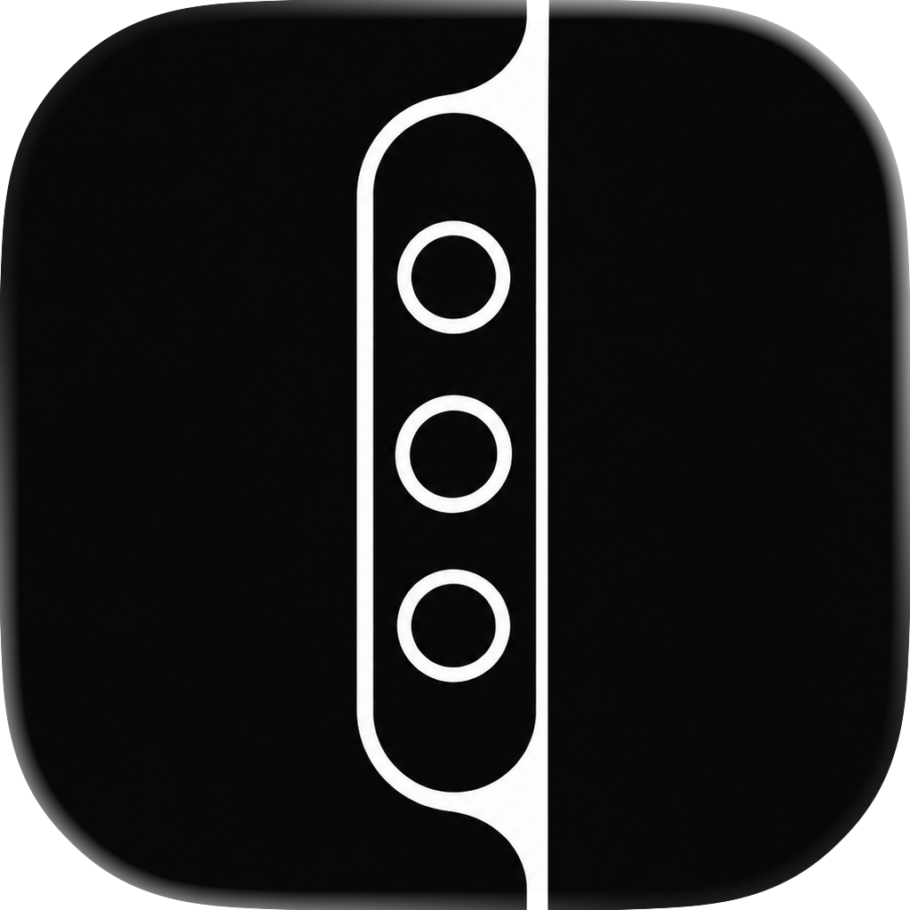
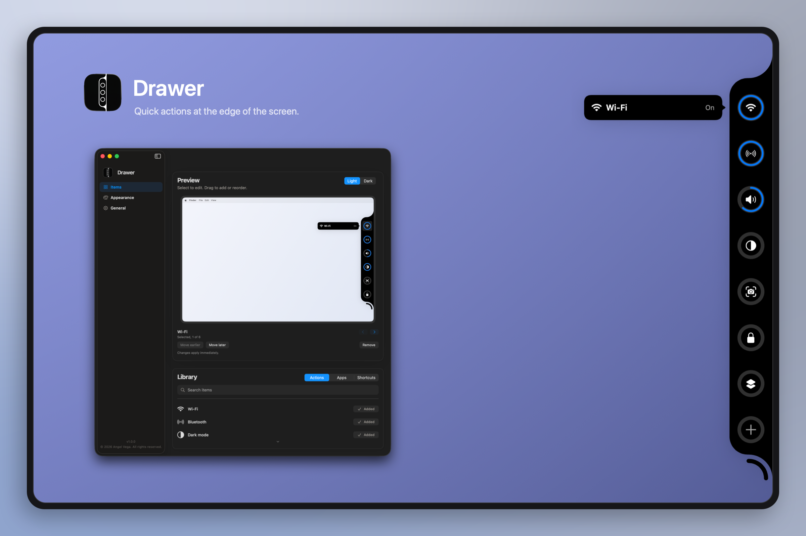
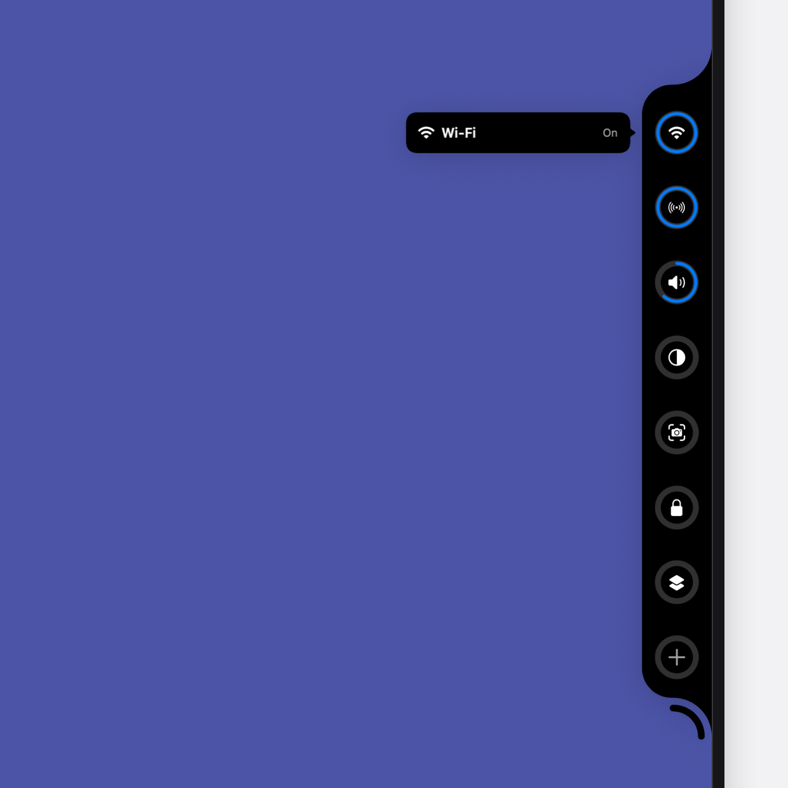
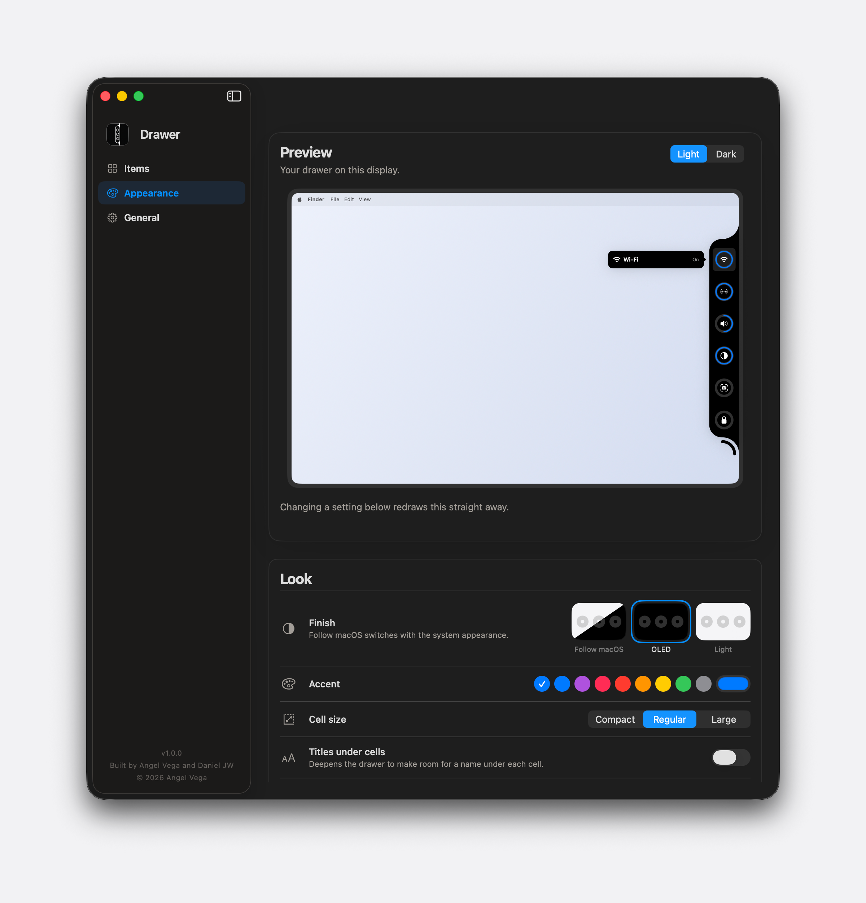
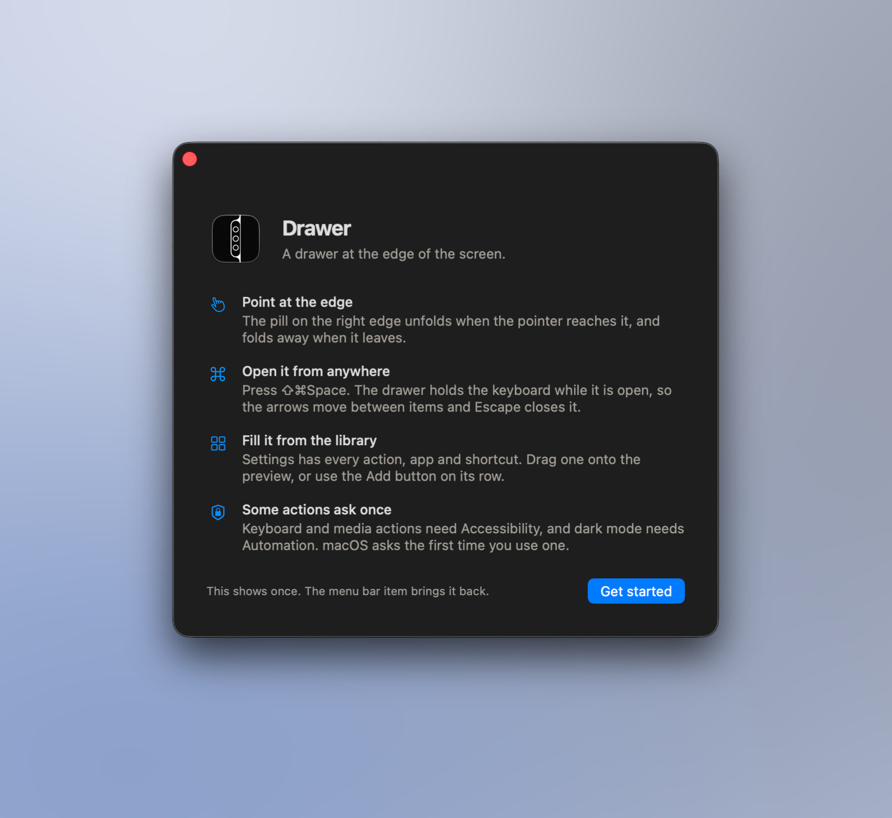

<p align="center">
  
</p>

<h1 align="center">Drawer</h1>

<p align="center">
  Quick actions at the edge of your screen. Point at the bezel and a black pill unfolds into Wi-Fi, volume, dark mode, a shortcut, an app. Point away and it folds back.
</p>

<p align="center">
  
</p>

A Mac gives you two places to put the things you use all day. The menu bar, which
is a row of icons you squint at, and the Dock, which is for apps. Neither one is
where your pointer already is.

Drawer is a third place. It lives on the screen edge, it is one hover away from
anywhere, and what goes in it is your decision: system toggles, levels you drag,
Apple Shortcuts, apps.

<p align="center">
  
</p>

Hover unfolds it, and the pointer leaving folds it away. Shift Command Space
opens it from anywhere, and while it is open by chord it holds the keyboard: the
arrows move between cells, Return activates one, Escape closes it. A cell says
what it is doing before you touch it, so Wi-Fi reads On and Volume reads the
level it is at.

## Install

Download the disk image from the
[latest release](https://github.com/advegaf/drawer/releases/latest), open it, and
drag Drawer into Applications. It is signed with a Developer ID and notarized by
Apple, so it opens on a normal double click.

Requires macOS 26.

## What can go in it

Forty one actions, every app you have installed, and every Apple Shortcut.

Wi-Fi, Bluetooth, dark mode, Night Shift, Stage Manager, volume and brightness as
levels you drag, mute, mute the microphone, keep awake, lock screen, sleep, sleep
displays, empty trash, three kinds of screenshot, screen recording, Mission
Control, show desktop, screen saver, quit the app in front, hide the others,
force quit, eject every disk, restart, shut down, log out, desktop icons, hidden
files, Dock and menu bar auto-hide, battery percentage, relaunch the Finder or
the Dock, play and pause, next and previous track, paste without formatting, lock
the keyboard so it can be wiped, and Focus.

A secondary click on Wi-Fi, Bluetooth or Volume opens a picker rather than a
toggle: the networks this Mac knows, the paired devices with the connected ones
first, or the outputs sound can go to. Reconnecting headphones is then two clicks
at the edge of the screen rather than a trip through System Settings.

The four that cannot be taken back (eject, restart, shut down, log out) do
nothing on the first click. The cell arms, and a second click within a few
seconds does it.

<p align="center">
  
</p>

Settings is one window with a live preview of your own drawer in it. Drag an item
from the library onto the preview to pin it, drag inside the preview to reorder,
and hover a row you have already added to turn the Added chip into a red Remove.
Command Z puts back whatever you just removed.

<p align="center">
  
</p>

Follow macOS, OLED or Light, an accent colour, three cell sizes, optional labels.
Follow macOS switches live with the system appearance. The resting pill stays
black in every finish, because a pale bar against a bezel is a smudge.

<p align="center">
  
</p>

The guide opens once, on the first launch after an install, and not again unless
you ask for it from the menu bar item.

## Permissions

macOS asks the first time an action needs one. Nothing leaves the machine: there
is no account, no analytics and no network call in the app.

| What you use | What it asks for | Why |
| --- | --- | --- |
| Dark mode, Empty Trash, Restart, Shut Down, Log Out, Force Quit | Automation | They are System Events and Finder commands |
| Clean Keyboard, Paste as Text, the transport keys | Accessibility | Posting and swallowing keystrokes needs it |
| Bluetooth | Bluetooth | Reading and setting the radio's power |

Focus is the one thing macOS gives no supported way to set. That cell opens
Control Center's own Focus list. To go straight to a single mode, make a shortcut
with the Set Focus action and pin the shortcut.

## Build it yourself

```sh
brew install xcodegen
make run     # generate the project, build, launch
make test    # the suite
```

`Tools/Screenshots/make-docs-images.sh` regenerates every image on this page, and
`Tools/Release/release.sh` builds a release: archive, Developer ID export,
notarize, staple, disk image, notarize the image, staple it. Every gate has to
pass before anything reaches `dist/`.

## Credit

Built by [Angel Vega](https://github.com/advegaf) and
[Daniel JW](https://github.com/Daniel-jw). Angel wrote the drawer itself, the
panel and its motion, the items model and the release tooling. Daniel wrote the
actions and the system integrations behind them, and the settings window with its
live preview and library.

Drawer grew out of an MIT project by [Vinz](https://github.com/vinzdg), whose
notch design is what the drawer's shape is still based on.

## Licence

MIT. See [LICENSE](LICENSE).
